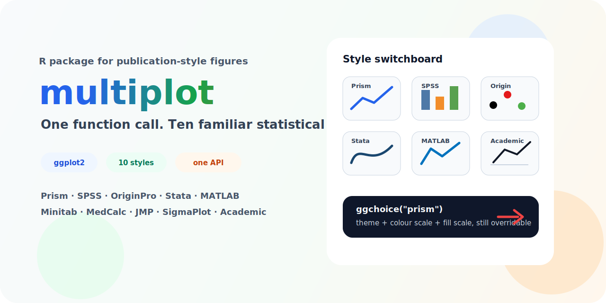

<p align="center">
  
</p>

<p align="center">
  <a href="https://github.com/sushuqiong/multiplot/actions/workflows/pkgdown.yaml"></a>
  <a href="https://www.r-project.org/"></a>
  <a href="https://ggplot2.tidyverse.org/"></a>
  <a href="LICENSE"></a>
  <a href="https://github.com/sushuqiong/multiplot/stargazers"></a>
</p>

# multiplot

Emulate the default statistical plot styles of nine graphing software packages
plus one academic publication style in R with **a single function call** — built
on top of **ggplot2**.

```r
library(ggplot2)
library(multiplot)

ggplot(mpg, aes(class, hwy)) +
  geom_boxplot(aes(fill = class)) +
  ggchoice("prism")   # one call = theme + colour + fill
```

## Highlights

- **One API for many software looks**: `ggchoice()` applies theme, colour scale, fill scale, and axis details together.
- **10 familiar visual styles**: Prism, SPSS, OriginPro, Stata, SigmaPlot, JMP, MATLAB, Minitab, MedCalc, and Academic.
- **Publication-friendly helpers**: Prism-style columns, error bars, boxplots, and comparison annotations.
- **Still pure ggplot2**: user-added scales after `ggchoice()` keep priority, so every style remains easy to customize.

## Why multiplot?

Every statistical graphing software (GraphPad Prism, SPSS, OriginPro, Stata,
MATLAB, ...) has a distinctive default visual style. When you move between
software, your plots look different. When you publish in R, reviewers often
expect a specific "look."

`multiplot` solves this by bundling each software-inspired visual style into
one function: **`ggchoice()`**. The `"academic"` style is an additional
publication-oriented benchmark rather than a real software default.

## Supported Styles

| Style | `ggchoice()` | Key Visuals |
|---|---|---|
| **GraphPad Prism** | `"prism"` | White bg, no grid, black box, sans-serif, pastel colours |
| **SPSS** (v12–24) | `"spss"` | White bg, light grey grid, box border, muted professional palette, sans-serif |
| **OriginPro** (classic) | `"origin"` | White bg, no grid, Black→Red→Green→Blue palette |
| **Stata** (s2color) | `"stata"` | Light bluish tint, 15-colour s2color palette |
| **Academic** (AMS/Science) | `"academic"` | Minimal B&W, no decoration, journal-ready |
| **SigmaPlot** | `"sigmaplot"` | B&W default, light grid, boxed legend |
| **JMP** | `"jmp"` | No grid, no frame, tick marks outside, clean |
| **MATLAB** (R2014b+) | `"matlab"` | Black outer box, 7-colour R2014b order, inward ticks |
| **Minitab** | `"minitab"` | Grey bg, dark blue lines, white grid, blue strips |
| **MedCalc** (ROC) | `"medcalc"` | White bg, legend inside plot, clinical contrast |

## Reproducing the manuscript figures

The package demo script generates all ten figures used in the companion
F1000Research Software Tool Article after `multiplot` has been installed:

```r
source(system.file("examples", "multiplot_demo.R", package = "multiplot"))
```

For a GitHub-install workflow:

```r
source("C:/Users/fengq/Desktop/multiplot_demo.R")
```

For local development from this repository:

```r
remotes::install_local(".", upgrade = "never")
source(system.file("examples", "multiplot_demo.R", package = "multiplot"))
```

The demo installs `multiplot` from GitHub only if the package is not already
available, and it does not remove or overwrite the user's global R library.

## Verification status

Direct screenshot checks currently cover Prism, SPSS, and MATLAB bar/box plots.
Additional screenshot or template comparisons cover JMP, MedCalc, Minitab,
OriginPro, SigmaPlot, and Stata for selected plot types. The package therefore
aims for practical **style emulation**, not pixel-perfect reproduction of every
commercial software output.

## Installation

```r
# From GitHub
remotes::install_github("sushuqiong/multiplot")
```

## Quick Start

```r
library(ggplot2)
library(multiplot)

p <- ggplot(mpg, aes(class, hwy)) + geom_boxplot(aes(fill = class))

# Switch style with one call
p + ggchoice("prism")     # GraphPad Prism look
p + ggchoice("spss")      # SPSS look
p + ggchoice("origin")    # OriginPro look
p + ggchoice("stata")     # Stata s2color look
p + ggchoice("matlab")    # MATLAB R2014b+ look
p + ggchoice()            # default theme_bw()
```

## Overriding scales

Scales are additive — user calls after `ggchoice()` take priority:

```r
ggplot(mpg, aes(class, hwy)) +
  geom_boxplot(aes(fill = class)) +
  ggchoice("prism") +
  scale_fill_brewer(palette = "Set2")   # your colour choice wins
```

## Prism-style features

**T-bar error bars + Prism-style columns:**
```r
df <- data.frame(group = c("A","B"), mean = c(10, 15), sd = c(2, 3))
ggplot(df, aes(group, mean)) +
  geom_col_prism(fill = "#5B9BD5") +
  geom_errorbar_prism(aes(ymin = mean - sd, ymax = mean + sd)) +
  ggchoice("prism")
```

**Statistical comparison annotations** (requires `ggpubr`):
```r
ggplot(ToothGrowth, aes(supp, len)) +
  geom_boxplot(aes(fill = supp)) +
  ggchoice("prism") +
  stat_compare_means_prism(comparisons = list(c("OJ", "VC")))
```

## Exported Functions

| Function | Description |
|---|---|
| `ggchoice(style)` | Apply a software's full visual style (theme + scales + axis offset) |
| `geom_errorbar_prism()` | Prism-style T-bar error bars |
| `geom_col_prism()` | Prism-style column bars (solid fill, thin black border) |
| `geom_boxplot_prism()` | Prism-style boxplot (black border, compact width, no outliers) |
| `stat_compare_means_prism()` | Prism-style significance annotations (wraps `ggpubr`) |
| `scale_shape_xxx()` | Software-specific point shape sequences (10 functions) |
| `ggchoice()` internal scales | Discrete colour/fill scales are applied automatically for each style |
| `scale_color/fill_xxx_c()` | Continuous colour/fill scales (heatmaps, surfaces, gradients) |

## Continuous Scales

For heatmaps and continuous data, append `_c` to the scale name:

```r
ggplot(volcano_df, aes(Var1, Var2, fill = value)) +
  geom_tile() +
  ggchoice("matlab") +
  scale_fill_matlab_c()      # Parula-style continuous gradient
```

Available: `prism_c`, `origin_c`, `matlab_c`, `stata_c`, `academic_c`,
`minitab_c`, `medcalc_c` (14 functions).

## Design

- **Theme always applies, scales are overridable.** `ggchoice()` returns a
  list of `theme()` + `scale_color()` + `scale_fill()`. Because ggplot2's `+`
  is "later wins," any `scale_*()` you add *after* `ggchoice()` takes priority.
- **No ggplot2 internals modified.** All themes inherit from `theme_bw()` or
  `theme_classic()`. All scales use `discrete_scale()`. Safe to use with any
  ggplot2 extension.
- **Palettes researched from real software defaults** (see Style Reference
  table in the vignette).

## License

MIT — see [LICENSE](LICENSE) for details.

## Citation and archived source

The current development target is `multiplot` v0.3.2. A version-specific Zenodo
DOI will be added here after the v0.3.2 GitHub release is archived.
